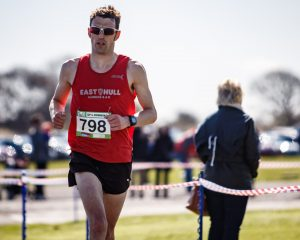

In the quest for a better 10 mile PB the next stop was the inaugural Vale of York 10. Thanks to Guy Gibson for bringing this race to my attention and also for chauffeur duties on race day.

The race started at an airfield (Gliding Centre) and this brings some very good benefits:

1. Ample parking for all spectators.
2. Plenty of space for Portaloos (and after picking up our numbers we didn’t have to wait too long).
3. Easy to find somewhere to warm up which I did after previous portaloo stop. Guy on the other hand did the tried and tested “static” warm up.

My training into the leadup had been curtailed slightly, firstly due to our vacation (although I still did 50+ miles over 12 days), however the main issue was falling ill on our return. The positive spin on this is hopefully I’d be fresher come race day due to the reduction in volume.

On to the race and after a slightly delayed start we were off. The start was slightly odd as it’s on the runway and to make sure we complete the right distance it goes a good half a mile before a 180 turn and back past the way you started.

Once out onto the roads proper the race takes in the some very quiet country roads (you benefit from completely closed roads). As promised it was very flat with only a couple of very minor “inclines”.

The course only goes through a couple of villages called Healaugh and Catterton. This for me was the only downside with a distinct lack of spectators out on the course. This might grow as the race does but with its location I can’t see it.

\[caption id="attachment\_47" align="alignleft" width="300"\] Vale of York 10 2016\[/caption\]

Back to my race and after the week just gone I didn’t want to push it therefore pre-race I decided to stick with 6.30 pace for the majority of the race and sneak under 65 minutes. This worked well for the first 6 miles which felt very comfortable. However, it’s funny how quickly a race can change, from “coasting” along, the next two miles were under target at 6.38 pace. No matter what I couldn’t up the pace, my legs felt like they had no power. I can only assume it was down to still recovering from the previous week.

The last two miles were back under target pace (6.28 /mi) but by then the damage had been done. I needed to run much faster for the last two miles. I finished outside 65 minutes in 65:13 and only 4 seconds off a PB.

As an aside, 2 days later I ran the summer league 5 mile in 30.27 averaging approx. 6.05 /mi giving me confidence that adequately recovered I can run well under 65 for 10 miles. Maybe I just need a summer league 10 miler and a load of red vests to chase for a better time (how about it Pete Dearing!?).

Next up on June 8th is the Otley 10 miles which is a low key affair with only about 60 runners. As it’s an evening race I’m hoping I can replicate Tuesday night form when I seem to run my best times. If not then I’ve heard about a potential local 10 miler near Gilberdyke at the end of August that will probably be another bite of the cherry.

\[caption id="attachment\_48" align="alignright" width="300"\] Guy Gibson – Vale of York 10 2016\[/caption\]

Back to the Vale of York, Guy Gibson is a consistent performer finishing in 1:14:32 for 165th. A time which he was very happy with.

If you’re looking for a flat fast early road season 10 miler then the Vale of York 10 comes highly recommend. It doesn’t have the hills of Ferriby and if it’s a still day like we had then much less windy than Snake Lane 10. I can see plenty of people setting a PB on the Vale of York 10 course. Also, there’s even some decent prize money for those that are fast enough.
