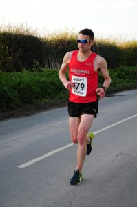

\[caption id="attachment\_93" align="alignleft" width="199"\] EHH Summer League 2 (Sproatley 6 miles) - 37:30, 23rd out of 218\[/caption\]

Race 2 in the EHH Summer League Series is the first of two races to start at Sproatley. This year I wouldn't be doing the second race  as the Phil Johnson 5k series clashes with the Sproatley 7. And I'd prefer to do the 5k as that's a standard distance. Likewise I'll be missing the Skirlaugh 8 to do the Doncaster Open 5k.

Anyway back to topic and for some reason the Sproatley 6 is one of my bogey races where I never hit the paces that I can in other races. Partly I think this is the course and there is always seems to be some wind but also I've often done a race a couple of days before plus a marathon in the proceeding month. The times to beat were as follows:

- 2015 - 00:37:30
- 2016 - 00:37:44

This year I'd have no excuses of half marathons or marathons. Surely I could sneak under 37 if nothing else?

Onto the race and the usual quick first mile (5:45), it starts with a slight downhill and combined with the fast lads plus the initial race adrenaline it's hard not to fly out the blocks. The usual group goes away and unlike the last race I found myself on my own. I decided to "run" with it (pun intended). It wasn't too long, probably in the second mile when a group including the City of Hulls legendary Steve Rennie, Carla Stansfield and my clubs Eddie Rex. I tried to stick with them but to be honest even before the race I wasn't feeling great. They gapped me fairly quickly and once again I was left running on my own with a few EHH lads not too far behind.

Around  2 to 3 miles my clubmate and adversary Lee Alcock caught me, the benefit is we could share the workload. However I was more concerned in keeping my average pace under 6:10 therefore I kept surging which Lee commented on post run. It would be better to run more consistently but no matter what I couldn't maintain pace.

The last two miles is mostly in one direction and as usual I find this section a drag. There always seems to be wind on this section not helping me maintain target pace.

Finally the great downhill start means a uphill finish, around 5 to 5.5 miles Lee left me and finished just ahead.

Once again I missed sub 37, finishing in 37:20 for 23rd place out of 218. However it was my fastest time on this course so that is at least something. For the record I have gone well under 37 on  a different course at last years Champagne League at Kiplingcoates finishing in 36:24. Oh well there's always next year :-)
