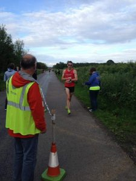

## Getting There

Leaving East Hull around 5 to go across the city to go is never the best idea but the journey to the race should only take 45 minutes and it was due to start at 7 so you would think it would be plenty of time, wouldn't it? However the old rocker himself Rod Stewart was playing the KC stadium but the bigger issue was the closure of the Humber Bridge due to a to a accident earlier. It started so well leaving at 5 I arrived at Kingston retail park by twenty past for my usual stop of coffee and cake. However it was then that getting back onto the  A63 I realised something was amiss. Checking on Facebook (while stationary I hasten to add) there was messages about the Humber Bridge being closed, it was re-opened again but the knock on effect left lots of stationary traffic. At least I had some substances while it took the 45 minutes to get from English Street to

## The race

\[caption id="attachment\_166" align="alignright" width="225"\] Just coming into the finish of race 2 of the Phil Johnson 5k series\[/caption\]

Just like the Otley 10 I'd record the race but not look at it until closer to the end. After a short briefing we as off, possibly even a couple of minutes early. There was a lead  group with club mates Robert Weekes and Steve Davey  and unlike the previous I'd try to keep closer order. Although I didn't hold on for that long it did result in a 5.42 first mile (possible my fastest ever during a race).

By this point we had a good pack of runners and I was shielded  behind 2 Barton runners. Just before the 2 miles point (completed in  5.59) we was joined by City of Hulls Sophie Lee, it now felt like the place was slowing  and I wanted to kick on. I think Sophie at the same thought as she picked up the pace. I tried to go with her but I wasn't strong enough. However  it did result in a final mile of 5:56 and the final 0.1 mi increasing to a pace of 5:29 for a 00:18:19 PB and 16th place and a new PB. As part of some big miles it's a very pleasing result.

Hats off to my club mates Robert Weekes finishing 4th in 16:29 and Steve Davey finishing 8th in 00:17:10.
