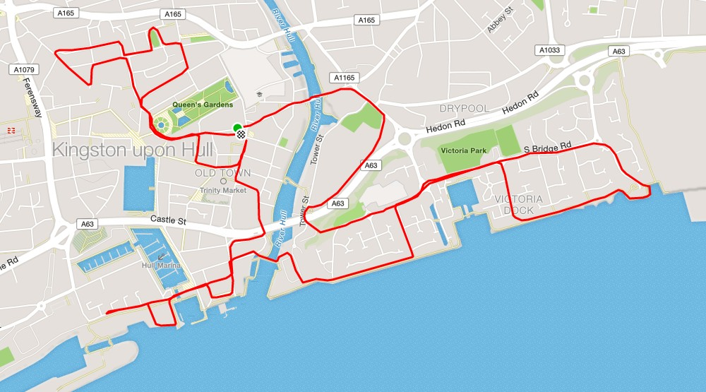

Loved and loathed in equal measure the Hull 10k divides opinions like no other race amongst local club runners. However there is no denying that a event (however you complete) that gets over 3500 people moving as got to be good, particularly if it raises a bit of cash for charity. Remember tomorrows "fun runner" could be tomorrow club runners.

One benefit of a local race is I could have a nice and relaxed start to the day. That involves a short bus journey, a good strong coffee and  a good chat with Tim Simpson and Mike Petersen as I made the way to the baggage area.

I warmed up next to the courts which allowed me to get close to the front with about 10 minutes from the start (thanks to last years winner and club mate Alec Gibson for that bit of advice). Eyeing up who was at the start I had decided like the [5k race](http://dlw.me.uk/2016/06/19/phil-johnson-5k-series-race-2/) from the previous Tuesday I'd go out very hard and see what pace I could maintain. To this end I could see Carla Stansfield (City of Hull) and Stephen Maddison (York Knavesmire Harriers), both are much faster than me but if I could keep them in sight then I should be dragged around to a decent time.

Onto the race and I barely made it to 1k before I started to drop off from my chosen targets, however the gap was growing slowly and the first mile was passed (for me) in a new best of 5:37. This was also the more straightforward portion of the course. The next two miles around Victoria Dock dropped to 6.04 and then 6.16. I'd have preferred to keep closer to 6 minute miling, however I was finding it much tougher than the 5k the previous Tuesday. Was I paying for the earlier fast first mile?

From here the course changes from previous years due to ongoing improvement works around Hull City Centre for the City of Culture 2017. It was a maze of twist and turns, somebody mentioned that there was over 60 turns on the course. To be honest I was really finding it tough going and I was just doing my best to hang in there and keep some level of pace. The benefit of this course is there is always something to think about and plenty of opportunity to see club mates going in the other direction. Talking of which just before 4 miles there is a 180 degree turn and I was surprised how close a few club mates where. This gave me some impetus to make sure I didn't drop off too much.

\[caption id="attachment\_178" align="aligncenter" width="1000"\] Just a couple of turns\[/caption\]

\[caption id="attachment\_179" align="alignright" width="165"\] Finishing strong at the Hull 10k\[/caption\]

Miles 4, 5, and 6 passed in 6:13, 6:16 and 6.06, the latter of which I think was thanks to the smell of the finish but also strong runner passed me at 5 miles and therefore I tried to stay with him.

For me the best thing about Hull 10k is the finish, a good 400m past Queens garden and then onto Alfred Gelder Street past all the crowds that always come out. Never one to disappoint I managed to pick up to 5.27 pace for the last .2 mile.

Overall happy with my Hull 10k as it was a season's best of 38:05 for 25th place and my second fastest 10k ever.
