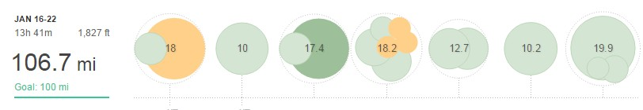

Back to back 100-mile weeks, 6/7 years ago when I started training I never dreamed I'd be writing that. So without further ado here's the training:

## Week 3 – 106.7mi (13H 41M)

**Monday** AM: Recovery: Easy 4 PM: 14mi - Strength workout - 2 x 4mi with 0.5mi recovery plus 3mi warm-up and 2'ish cooldown

**Tuesday** PM: 10mi easy (but felt shocking) to work

**Wednesday** AM: 3.9mi Easy XC PM: 13.4mi midweek LSR

**Thursday** AM: 6mi Recovery XC PM: 12.2mi - EHH Hills workout - 15 minutes, rest, 10minutes, rest, 5 minutes

**Friday** AM: 6.5mi Easy PM: 6.2mi Easy

**Saturday** PM: 10.2mi - Clubs XC Pack Run

**Sunday** AM: 20mi - 3mi up + 15mi @ MP pace (6:30 per mile) + 2 mi cool down

After the previous week's long run I expected the Monday strength session to be hard work. Obviously it was but actually felt pretty good which is reassuring.

The next key session was the hills workout. This is a club session with whoever turns up running up and down one side of a flyover in East Hull. Each loop is about 0.25 miles. I hadn't done this session since the start of December and I could tell my fitness as improved massively. The 15minute section wasn't much faster but felt more comfortable and the other two sections were much faster.

After that a couple of easy sessions before the mammoth LSR @ MP pace (or I should say hopeful MP pace). I can't argue with 15 miles at 6:28 average, 2 seconds under MP pace. Yes it was hard and I couldn't have done that much more but I won't be doing 100 miles marathon week and the 5 loop I used is fairly rolling, technical with lots of divots etc. A nice smooth road will make a massive difference.

Next week is a recovery week with reduced mileage. I'll do a couple of recovery weeks to coincide with races. This one is the Ferriby 10 (report to follow).
