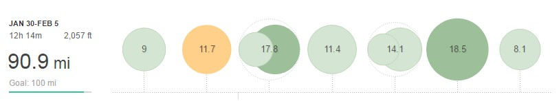

After the high of last weeks Ferriby 10 and the welcome relief of a lower mileage week it was back to the grind this week.

## Week 5 – 90.9MI (12H 14M)

**Monday** AM: 9mi Easy (Commute)

**Tuesday** AM: 11.7mi - Strength: 3 x 2 mile @ 6:20 plus 3 warm up + cool down

**Wednesday** AM: 5.8mi - Base mileage PM: 12mi - Midweek LSR

**Thursday** PM: 11.4mi – Base mileage

**Friday** AM: 9.1mi – Base mileage PM: 5mi – Base mileage

**Saturday** AM: 18.5mi - Fast long - 3 x 3 mi, 1 x 2 mi @ MP with 1 mi recovery with 3 mi warm-up plus cool down

**Sunday** AM: 8.1mi - Base Mileage

As usual, the first key session of the week was Tuesday. After the previous weekend's race, I took it easy Monday and due to having a class post work on Tuesday I attempted a strength session on the morning. 3 x 2-mile first thing with a decent headwind was never going to be pretty and that's how it transpired. Of course, 1 bad session doesn't matter and it was still a decent 12-mile session.

The rest of the week ended up being base mileage. I had planned to do hills on Thursday but to save time I ran home from work and with one eye on Saturdays long fast run kept it steady.

As we were off away for the weekend I made sure I got out the door relatively early Saturday, this time for a fast long run. I didn't like the idea of doing tempo/MP pace for 12 to 16 miles therefore instead did a long strength workout. The 3-mile reps went well with only the first 3 slightly off the pace. The final quick two were added in last minute as the run was still on the short side even with a cool down.

Overall I may not have hit triple digits for the week, however, 90 miles is still a good amount particularly after a hard race the week before and being away the Saturday and Sunday night at the end of the week.
