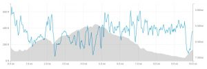
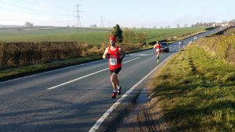
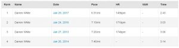

Now that was a surprise, let me back up a little.

Prior to the race, I've done 100 miles for week 1, 106 miles for week 2. Ferriby 10 falls in week 3 with the aim of doing 75 miles including the race.

Raceday and I didn't feel that great, the two cups of coffee helped, however, confidence wasn't high. Particularly as I had also been feeling sluggish the few days before the race. At least the rain had missed us and a largely frost free morning with a glorious sunrise gave the runners an almost perfect racing day.

Danny Wilson, one of my club mates and training partners was racing this one and his target time of 63 minutes sounded good. My PB for 10 miles is 64:14 (slow considering I have a 37:35 10k PB) therefore I'd definitely take something in that region.

\[caption id="attachment\_282" align="alignright" width="300"\] Ferriby 10 Course Profile\[/caption\]

As for the race, I positioned myself in my now customary position of just behind the "fast" lads. The race starts with a super fast downhill before a sharp right turn. This makes for a fast and manic start with the race luring you into a false sense of security. Ferriby 10 is well known for having a hard first half with an easier second half.

I went with the early pace as I knew what was to come. Although 5:48 for the first mile was maybe a little too rapid!

After the relative ease of the first mile, it's then a long slog up to Little Weighton Road. I dropped back a little from the group I was running with, as ever I wasn't too worried as I struggle on the uphill sections. The second mile completed in 6:28 which is to be expected.

A short sharp descent into Little Weighton allows you to pick up the speed before it rises steeply again past the pubs in the village. A right bend and the course carries on rising for the next mile along a quiet country road. At this point, I had to tell myself to dig in and push on. The 3rd mile in 6:19 with two more undulating miles to come. At the time it felt awful but I had no idea of the pace.

The 4th mile takes you along Westoby lane towards Riplingham, the start of which was the only part to remain icy. My choice of very low profile racing flats didn't help matters! 4th and 5th mile in 6:34 and 6:30 respectively.

\[caption id="attachment\_285" align="alignleft" width="300"\] Losing touch with Danny about halfway in\[/caption\]

Finally just before Riplingham at the left turn is the 5-mile mark. Before the race, I wouldn't allow myself to look at my watch until the half way point. Thankfully all the hurt was worth it as I passed halfway 31:42, a good two minutes better than ever before with the best section to come. Danny had gapped me at this point but I had hoped to catch him back up once we got to the downhill.

As mentioned we turn left at Riplingham for the long descent to Raywell (with a little bump for good measure). 5:49 and 5:58 for miles 6 and 7. Just before the 7-mile mark, there are a few bends and some of the drivers are complete morons, overtaking when they have no idea what is coming and having to pull sharply in almost taking out a couple of runners ahead. Is being delayed by 20/30 seconds that big of a deal?

Back to the race and another left turn brings you onto the long run for home. I never enjoy this section as I'm always in a world of pain and it goes on forever. 2 and a half miles before the next turn with the windmill in site once you hit a mile to a mile and half to go can be very demoralising. However this year I was having the Ferriby race of my life, therefore, it was a case of banishing any demons and digging in. 7th and 8th mile in 5:51 and 6:03, perfect, I even got delusional and thought maybe a sub 61 was on the cards. Also by this point any thoughts of catching Danny were long departed and the focus was on form, pace and getting to the finish.

\[gallery columns="2" link="file" size="medium" ids="287,286"\]

\[caption id="attachment\_283" align="alignright" width="300"\] Skidby Mill Climb\[/caption\]

However, Ferriby is the race that just keeps on giving and with half a mile to go you take a left turn and head uphill. When warming up I ran down and up and it didn't seem as steep as I always remember. How foolish was I, with 9 and a half miles in the legs it was a real slog. I don't normally pay attention to segments on Strava but for this one I did and it was my best ever, yet it still felt so slow!

One last push for a 61:36 finish, some 2minutes 38 quicker than my 10-mile PB and that was on a flat course. I was 31 out of 708 finishes.
