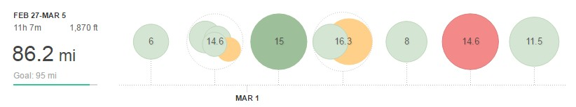

Week 9 and I was hoping to get back into the 100-mile range. However, I missed a couple of runs and was just a little short of a couple of others, therefore, topped out at 86 as follows:

Week 9 – 86.2MI (11H 7M)

**Monday** AM: 6mi easy

**Tuesday** AM: 5mi easy PM: 9.6mi (3.5mi warm-up + 3 mi speed work + 3mi cool down)

**Wednesday** PM: 15mi LSR

**Thursday** AM: 6mi easy PM: 10.3mi - strength workout: 4 x 1 mile @ 6:20 off 0.5 (plus 3 warm-up and 2ish cool down)

**Friday** PM: 8 mi easy

**Saturday** AM: 14.6 mi hard (race, sort of)

**Sunday** AM: 11.5 mi easy

I cut Monday short as my legs were still beat up unsurprisingly from the race the day before. Tuesday then would be my first hard session and I chose to keep it short and do the clubs 3-mile speed session (3 x 1200m, 1x 800m and 1 x 400m). Not a bad session but just over 50 seconds slower for the reps in total shows the legs weren't entirely recovered. It also didn't help that there were only 5 runners that turned up.

Thankfully the legs had recovered somewhat for Thursday strength workout evening finishing in 6:09 for the last rep. I chose to stick to 4 reps and keep the overall volume low as I'd be running the short loop of the Golden Fleece Circuit.

After an easy Friday, Saturday rolled around and it would be an early start for the Golden Fleece circuit. It's not really a race but I think a few at the pointy end treat it as such. Hard work but getting on for 20 minutes quicker than last year (what a difference an extra 400+ miles by this point in the year makes) therefore second place in 1:44:01 behind me old mucker Danny W.
