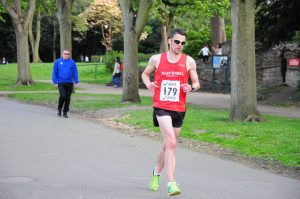
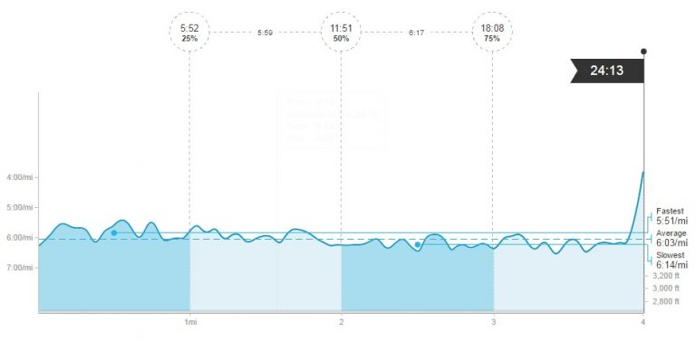

Race 3 of the Summer League and one of my favourites of the series. Partly because I've ran pretty well the two times I've done this race and it's nice and short!  Last year was particularly good and still the only race where I've finished the race averaging under 6 minute miling. My times from the last two years are as follows:

- 2015 -23:41
- 2014 - 24:16

\[caption id="attachment\_103" align="alignright" width="300"\] EHH Summer League 3 (East Park 4 miles) - 18th out 217 in 24:13\[/caption\]

I didn't think I was in quite the same form as last year but still would have liked a very low 24 or ideally sub 24. For this reason at the start line I spied who was about, seeing Ian Grewer and Stephen Rennie were on the start line I decided they would me a good couple of runners to stick with as I know both often come past me in the first couple of miles therefore they start steadier but maintain the pace better. However onto the race and we did start steadier (or at least I thought we had!) but the first mile was still covered in a fairly swift 5:51 - about 6 seconds down on last year.

After the first loop of the left hand side of the park (the side mainly without the lake) we then start the first of the two loops around the lake and animal enclosure that will be very familiar to anybody that does East Park parkrun. At this point we still had a good group of myself, Danny Wilson, Paul Bennett, Ian Grewer, Stephen Rennie and a lad from Bridlington RR (Mark Woodley). After a mile and half we picked up the even faster starting Lee Alcock. At this point the group started to splinter as on the back straight past the lake Stephen Rennie pushed the pace (or we started to slow). Ideally I would have liked to have followed but it felt like I was running through treacle.

The first 2 miles was covered in  a decent 11:51. If I could just run close to 6 minute miling then I'd still stand a chance of around 24:00.

I always find the top section past the animal enclosures difficult and this year was no different. At this point I think Ian Grewer and Paul Bennett started to go away, at the same time I think I started to gap Lee Alcock and Danny Wilson.

Onto the final loop (second around the lake) and I have a significant gap on Lee and I'm still with striking distances of Paul and Ian. Just after 3 miles we pick up Eddie Rex and I try to encourage him to push on with me to keep Paul and Ian in check. We both share the lead pushing each other to keep going. Around the bend before passing the animal enclosure I have a cheeky look for Lee as I can no longer hear him. The gap looks significant and rather stupidly I think I may have the beating of him for once.

However I should know better and in the last half a mile Lee catches and passes me. I let the gap grow too much but I do put on an almighty sprint finish to catch and pass both Ian and Paul as you can see from the graph below:

My official time was 24:13 for 18th place out of 217 runners. At the time I was a little disappointed and in hindsight I am pleased with how consistent I have been but not happy that I lost so much time in the last 2 miles. However a 6am start (and awake at 4am) to drive to Liverpool and back in the same day before racing woudln't have helped. Next year I have to nail that 3rd mile, for comparison here is the last two years:

  

2015

2016

5:45 /mi

5:51 /mi

5:56 /mi

5:58 /mi

6:11 /mi

6:14 /mi

6:00 /mi

6:08 /mi

The question is next year do I take the first mile even slower or trust that I can hang on better? A little break before my next race which is the Summer League again, this time Leven 10k which is my current 10k PB of 37:35 - the aim will be to go under 38 as I've only done it this once. In the meantime is back to back 70+ mile weeks.
