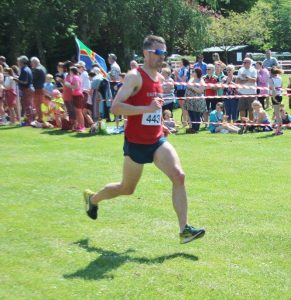

After Tuesday's sufferfest at the [Leven 10k](http://dlw.me.uk/2016/06/06/summer-league-race-4-leven-10k/), I was hoping for redemption at Woodhall Spa 10k. I gave myself a few goals just to make sure I could be flexible come race time.

- Sub 40
- Sub 39
- Sub 38
- Dreamland would be a new PB

The last two were probably overly optimistic and I would have only been marginally happy with a sub 40. I really wanted 38 something and preferably the lower end but I'd have to see how I'd recovered.

Pre race day and training was getting back to normal, I scrapped Thursday hard session in a bid to be fully recovered for this race. Post runs I was still coughing but overall much better than Monday/Tuesday. One thing I did get enough of was sleep, Saturday night pre-race I was falling asleep pre 9 o'clock therefore asleep well before half past and waking up at around 5.30am. This isn't that unusual for me although I normally go to be closer to 10pm.

## Race day - pre race

Running gear was set up the night before therefore race day was the usual pint of water and porridge with berries and some sunflower seeds (and probably a little honey). The race wasn't until 11:15am but we did need to travel the 1 and half hours to get to Woodhall Spa. Steve T was picking me up at 8:20am and then two others (Danny W and Mike P) making 4 from our club in Steve's car. Thanks as ever for Steve who is one of my regular chauffeurs!

## Warm Up

After parking up and a short walk to the park and caravan park it was a case of using the facilities and then waiting to warm up. It was still only 10:15am therefore I wanted to wait 20 to 25 minutes. Conveniently next to the toilets was a cricket ground and I was able to do laps of the field for a 2 mile warm up inc. a few drills and dynamic stretches (a proper warm up routine is something I need to work on).

Sufficiently warmed up it there was a short walk to the start. Out of the 4 of us, 3 would be going for around the 38:30 mark. I didn't want to start to rapid considering the recent week therefore I was happy to let the others set the pace and just drop in behind (in hindsight was that ever going to happen!).

The first mile took us out to Reeds Beck before the first left turn, the three of us plus several others covered that in a decent 6.04. Ideally I'd keep this pace for the full race but with the greatest will in the world this seemed unlikely.

The second mile skirts Halstead Wood with a minor right curve. We were still on pace with a 6.08, however I could sense Mike P (and possibly Danny W) was struggling and the group was starting to splinter. Rather than sit in I made the decision to try and go with the group ahead (so much for going with the flow!). At this point I dropped Mike P and I thought Danny W. However after less than half a mile Danny was back and we ran for the majority of the race.

At 2.5 miles another left turn at to go past Stixwould Wood and on into Stixwould proper with the third mile dropping to 6:12 - not too bad but ideally I wouldn't let it drop any further.

\[caption id="attachment\_125" align="alignright" width="291"\] Sprint finish for 38:51 at the Woodhall Spa 10k 2016\[/caption\]

However I obviously wasn't fully fit (the post run coughing fit would be testament to that) and miles 4 and 5 were 6:23 and 6:26 - there is no way I'm not strong enough to maintain a better pace than that. The recent Summer League races with the exception of Leven prove that. At the 4 mile mark we passed   Stixwould  before another left turn to start heading back to Woodhall Spa.

It was at 5 miles when Danny started to pull away, this is normally when I can put a fast final mile in but today the legs just wasn't responding. A final right turn around 5.25 miles leads us back to the park. Pace for mile 6 was 6:31. I did at least manage a final sprint for the line averaging 5:35 for the final 0.2 miles. It helped that the finish is just inside the caravan park with all the spectators.

Overall happy with 38:51 for 57th place out of just over a 1000 runners. Impeccable organisation and it helped that we had a gorgeous sunny day.
