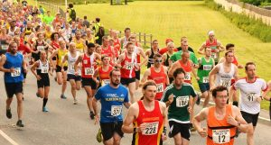
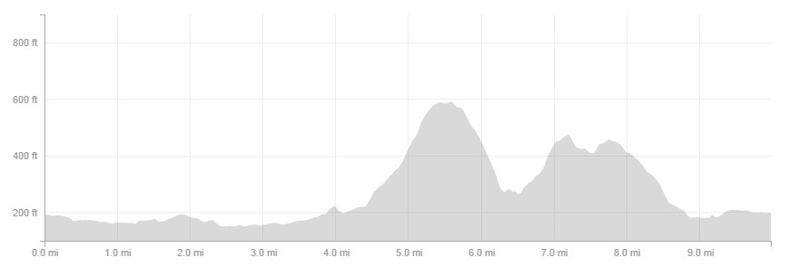
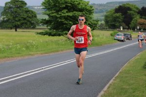
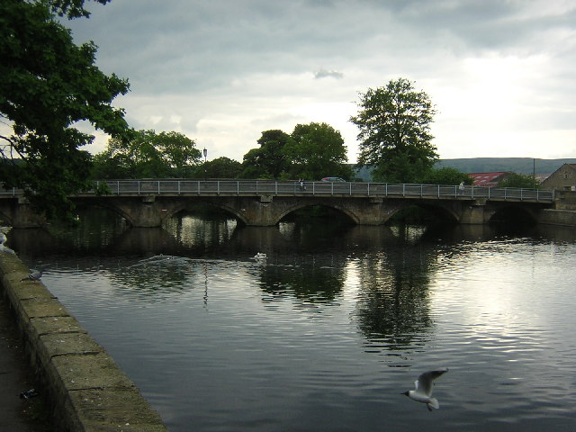
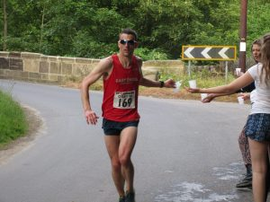

I ended up doing the Otley 10 as I was looking for a fairly local 10 miler. At the time the Gilberdyke 10 had not been announced and the closest I could find was the Otley 10.

As it turned out on race day I'd be working in Liverpool. At the time this seemed like a good thing (more on that later) as I could come back home via Otley from Liverpool. However it would  mean being at the Liverpool I.T. head office for 9am (so I could leave by 3.30pm). That meant making sure all kit, food etc. was sorted the night before and  alarm set for 5.30am. As it turns out I was up with the birds from around 4.10am eventually giving up and getting up at 5am. The positive side of this I was on the road by 5.30am arriving in Liverpool after a fairly pain free  journey just after 8am.

Fast forward 7 and half hours to start the journey east to Otley. I had 4 hours to travel the 75 miles, surely that would be ample time? I was even hopeful  that I'd have time to try and have a quick nap in the car. As the saying goes "the best-laid plans of mice and men often go awry" ..... I never factored in the 1 and half hours to travel 20/30 miles along the M60. In the end I arrived (admittedly after a coffee and cake stop) in Otley just before 6.30pm.

## Warm Up

After a quick change and a look around the HQ (Otley Cricket Club), it was time to get into "race mode", that meant some dynamic stretches and a 1 to 2 mile warm up. I wasn't expecting anybody from Hull therefore I was a little surprised when I heard my name being shouted. It won't come as surprise to many that the originator of the shout was none other than serial racer Rich Harrison (KUHAC).  After finishing my warm up I was able to catch up with him back at the HQ. Also there was another regular racer (now of York Knavesmire Harriers) Stephen Maddison. It was good to see some familiar faces and have somebody to chat to while walking to the start, which was approximately 10 minutes walk away.

## Race Time

\[caption id="attachment\_137" align="alignright" width="300"\] Racing to get into position at the start of the Otley 10 2016\[/caption\]

The Otley 10 doubles up as the Yorkshire 10-Mile Championship therefore I expected some fast times at the pointy end and it was best not to get too carried away with those at the front. Having said that although the start is just off the main road up a slight incline, the route quickly turned left onto the rough track at the side of a busy A road. For that reason it would be a good idea to be quick out of the blocks to ensure a good position once we made the the turn and to avoid being stuck behind slower moving track.

Having checked the course profile briefly (only after Steve Taylor mentioned it might be hilly - it had not occurred to me prior to signing up!), I knew there was too nasty climbs but not entirely sure when. Therefore due to my inability to run uphill with any kind of pace the pre-race plan would be to run as hard as possible (shouldn't it always be...) and probably crawl up the inclines. Also I decided that I'd record the run but not look at my watch.

\[caption id="attachment\_139" align="alignnone" width="869"\] The two hills as part of the Otley 10 course\[/caption\]

\[caption id="attachment\_140" align="alignleft" width="300"\] Looking strong before the hills started\[/caption\]

Back to the race and after the initial first left we hugged the left hand side of the busy A659 (Pool Road) for the next 2 miles before thankfully a left over the stunning River Wharfe onto a marginally quieter country road. It wasn't long before another left turn onto the much rougher but very welcome leathley Lane. The first 3 miles in a fairly decent 19 minutes, not that I knew this at the time. At this point I was wondering where the first incline was as I had expected it by now.

\[caption id="attachment\_147" align="aligncenter" width="640"\] The stunning River Wharfe\[/caption\]

However I didn't have long to wait, the inline starts from 3 to 4 miles (slowing to a 6:44 mile) but the real kicker is from mile 4 to 5 and half (you know you're in trouble when you see a sign that says 16%). At points I was well over 10 minute mile pace. One positive was the glorious view we was rewarded with at the highest point in the race  (just a shame about some very impatient drivers - overtaking in some very dangerous places).

\[caption id="attachment\_141" align="alignright" width="300"\] Not looking as fresh at the second water station\[/caption\]

As the saying goes "what goes up must come down" and for the next mile we can free fall and get back some of the time lost. Around 6.5 miles the second water station was a welcome site before another steep  incline. Again though the reward would be a great view and a mile long descent, probably my favourite part of the race (and fastest mile 5:55) with a group of 4 of us all strung out flying down back into Otley.

The final mile seemed like a real slog with a tricky couple of 90 degree turns before we came back onto the path along the main street through Otley. I would recommend making yourself aware of the route to the finish as I made a school boy error. I could see the ASDA and cricket club which I thought would lead to the finish therefore I started to pick up the pace aware that there was a runner not too far behind, however we went past the entrance to the cricket club before a left turn afterwards and then around the field (similar to Walkington 10k) to the finish. After my false kick this time I made sure I saved a little and didn't kick too soon to make sure the runner just behind stayed there. Happy with 67:18 for 42nd place out of 367 place. Excellent runs by Stephen Maddison (16th in 62:55) and Rich Harrison (137th in 77:40 ).

Each runner received a fine bottle of Ale (it was a blonde which isn't my favourite so the welcome recipient was my wife) plus with the cricket club bar and a BBQ outside what more could you want.
