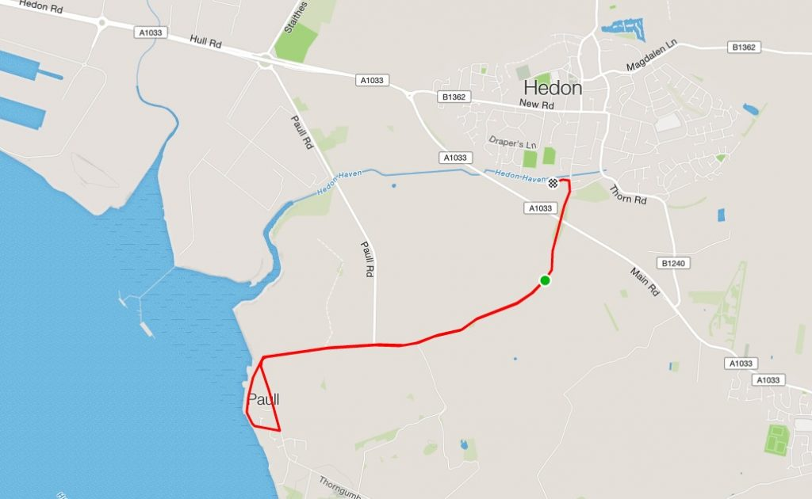
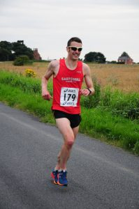
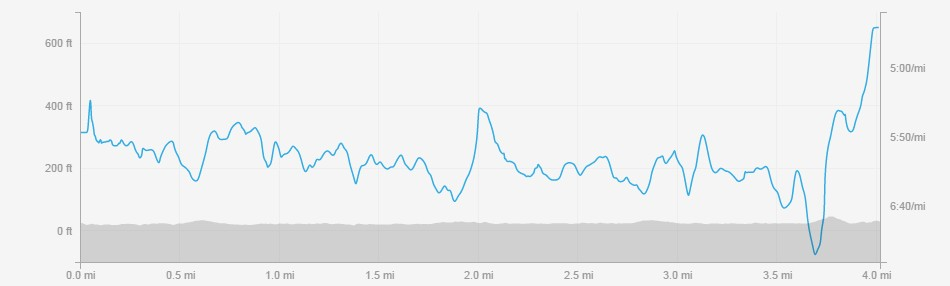

After a summer league hiatus (due to running other the Phil Johnson 5k and Doncaster Open 5k) I was back for the final race in the series. Last year we had monsoon like conditions and after the recent good weather I was hoping for a hot one. Alas it wasn't to be but the rain held off until after the race and it was even just about good enough for me to race in the customary shades.

Last year Katy and myself biked to Hedon in atrocious conditions (so much so that my left calf started cramping). We wasn't making that mistake again and instead got a lift off a couple of club members. We all arrived in good time to get parked at the pub (bonus) and chat to some other club mates.

Summer league races start at 7.15pm and this particular race the start is about half a mile from the pub. After some dynamic stretches and with 20 minutes to go I made my way to the start.  The legs felt pretty good on the warm up but this isn't always indicative of a good race, many times they feel great and I race badly or vica versa. Anyway the main thing I noticed is as usual there was a decent headwind on the way out to Paull. This isn't that surprising as the race starts in Hedon and goes to Paull which sits on the bank of the River Humber. I think it's a very rare occurrence for there to be no wind.

\[caption id="attachment\_186" align="alignnone" width="764"\] Hedon to Paull straight into the usual headwind coming off the humber\[/caption\]

Onto the race and as usual I found myself in the second big pack along with club mates Eddie Rex, Lee Alcock and I think some Bridlington runners. The first mile felt good with me trying to shelter behind some of the other runners. As gaps started to appear I decided to try and drop Eddie and Lee as in particular I could see Danny Wilson just ahead. However Lee is not a man that gives up and he came with me with a small gap to Eddie. We caught Danny Wilson around1 mile when you turn left to go through Paull.

\[caption id="attachment\_190" align="alignright" width="199"\] Trying to smile for the camera\[/caption\]

Unfortunately during the route round and through Paull Danny and Lee dropped me, I maintained the gap through the next mile but wasn't able to close it. This meant running the next mile to a mile and half on my own. Before the finish the course take you over a flyover before going back into Hedon. At this point a a KuHAC runner and COH runner caught me. Being a particular bad uphill runner they did start to gap be on the ascent but after running and doing the work on my own for so long I was adamant I wasn't going to get beat. That meant keeping in touch until the final corner which is just before the finish and only a couple of hundred metres to the finish.

It's one thing having a plan though, another to actually execute it. Myself and Andrew Hemmings (CoH) gapped the KuHAC runner but I was still 1 or 2 metres behind Andrew coming into the finishing straight. I launched my sprint but worryingly still only managed to get onto his shoulder, I thought I didn't have any more pace, however I made a split second decision to give it everything I had, from somewhere I managed to find a but more and finish I second ahead. I think it was my fastest ever finish as the graph below shows.

\[caption id="attachment\_189" align="alignnone" width="950"\] Hedon 4 pace graph, slow uphill with fast finish\[/caption\]

I finished in 16th out of 188 runners in a time of 24:32 for 4 miles. I'd always want to be lower 24 or sub 24 for 4 miles but after a couple of dodgy races and Parkrun I was very happy with the my performance. Hopefully I can keep it up for a another two miles at the Great Grimsby 10k on Sunday.
