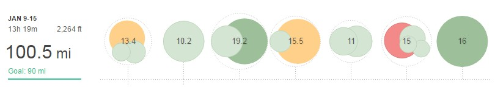

Wow, my first ever 100-mile week (and by the way first over 85). And it felt surprisingly OK on most of my runs.

Week 2 (9th to 15th January):

**Monday** PM: 13.4mi (3.2mi warm up + 8mi cut down starting at 7:10 and taking 10 seconds a mile off each mile + 2.2mi cool down)

**Tuesday** AM: Easy 10.2mi commute to work

**Wednesday** AM: 6.2mi Recovery XC PM: 13mi Midweek LSR

**Thursday** AM: 3mi recovery XC (as getting the bus to work) PM: 12.4mi - 6 x 1mi @ 6:20 with 0.25 recovery (plus 3mi warm up and cool down)

**Friday** AM: 5mi slightly snowy half run, half bus to work PM: 6mi steady

**Saturday** AM: 4.2mi Recovery XC PM: 10.8mi - 8 mi Club Cross Country Champs 2016/2017 + 2mi warm up + 1 mi cool down

**Sunday** AM: 16mi LSR

The key sessions are Monday's cut-down, Thursdays mile repeats and the club championship race.

After a fairly light weekend due to the 5k race and being away Mondays cut-down felt surprisingly good. However, I still didn't quite hit 6-minute mile pace at the end. As a side note, the run to work Tuesday felt shocking as usual. I was hoping to do closer to 12 miles but I couldn't get much under 9-minute mile pace.

Wednesdays were all very much run of the mill therefore onto Thursday. The mile reps were done running back from work. They felt pretty hard and dodging pedestrians, dog walkers, traffic always adds to the difficulty. Happy to hit the 6:20 pace even if they were harder than I'd like.

Onto Saturday the clubs cross country was a war of attrition, to say the least. Anyway I'll have a full report on the race on the blog, therefore, I hung in there and for cross country posted a fairly decent time of 53:18

Sunday was a good gentle run with a couple of club mates. Legs were pretty heavy but after a massive week, it was good to get another one in the bank.

Week 3 is another 100-mile week and no races.
