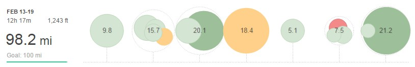
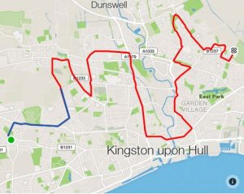
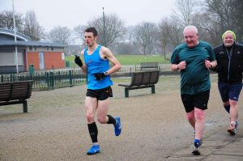

I'll let myself of being short of 100 by only 1.8 miles as it was an epic week of training as follows:

## Week 7 – 98.2MI (12H 17M)

**Monday** PM: 9.8mi - Base Mileage

**Tuesday** AM: 6mi - Base Mileage PM: 9.7mi - 3mi speed plus warm-up and cool down

**Wednesday** AM: 6mi - Base Mileage PM: 14mi - Midweek LSR

**Thursday** PM: 18.4mi - Strength: 5 x 2 miles @ 6:20 per mile with 0.5 recovery plus 3 up and down

**Friday** AM: 5mi - Recovery

**Saturday** AM: 7.5mi - Parkrun - 3mi warm-up + 3.1mi parkrun + 1.5mi cool down

**Sunday** AM: 21.2mi - Long Run

The first key session of the was Tuesday's speed work with the club. After an extended warm-up it was 3 x 1200m, 1 x 800m and 1 x 400. I averaged my fasted ever time of 5:21 per mile for the session which shows the training is working plus I even managed to get quicker as the reps got shorted. Sometimes I struggle with the middle 800m.

\[caption id="attachment\_295" align="alignleft" width="300"\] Round the houses, Thursday's Epic Run Route\[/caption\]

Wednesday was all about volume as usual before Thursday monstrous strength workout. Most of the 2-mile reps were there or thereabouts, just a little slow for the last two, although the wind didn't help. Just over 18 miles for a workout isn't to be sniffed at.

Friday I dropped to a single session to try and recover before Saturday as I wanted to test myself at Parkrun.

\[caption id="attachment\_297" align="alignright" width="300"\] Working hard and dodgy form in the last half of mile\[/caption\]

Come Saturday and I really wasn't sure how the legs would hold up. I know I'm in reasonable shape therefore if they were fresh then I should be able to get a good time. I went with the leading runners (bar 1 who was way off the front). 5:45 for the first mile and it didn't feel as bad as it could. Slower for the next two plus avoiding traffic in the third but came away with an 18:05 for a parkrun PB and my fastest average pace for a "race". Then only downsides are being outsprinted at the end by a club mate and not breaking 18:00. However, it's fuel for another day.

For Sunday I had rather foolishly scheduled a fast long run. In the end, I went out with some of the boys so my plan went out the window. Probably for the best as I was shattered and couldn't have held 6:30 for 16 miles. Nobody else wanted to run really fast so we settled into around 6:45, I averaged 6:48 but I did fall off the back towards the end and could have been dropped at any point if they had wanted to speed up. I can't be entirely disappointed with the run as considering my week's mileage, what I had done in the second half of the week then I know there is a lot more in the tank.

Overall a really good week. Next week I have Snake Lane 10 therefore I'll be front-loading the week and sticking to two hard sessions for the week.
