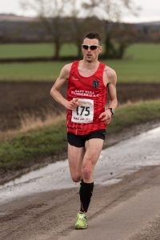
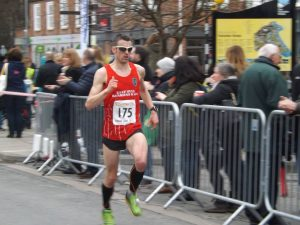

Coming into Snake Lane I was expecting a big result. It's hard to be objective as I write this post race. However averaging 90 miles a week since the start of the year and some stellar speed and long strength sessions meant confidence was high.

Come race day and handily the start is about a mile away therefore after the usual pre-race pitstops myself and Danny W warmed up by running to the start line and adding a bit on. At this point, we bumped into club mates Danny J and Tom D. Danny J wasn't racing but would be on pacing duties for Tom.

After a brief catch up it was time to get to the start. We were stood a little far back to one side therefore in the process of "losing" my warm-up t-shirt I got closer to the front, however, this meant I was no longer with the aforementioned. I wasn't worried as I assumed they would catch me up at some point and it would allow me to run my own race at least initially.

The plan would be to go out hard as this course unlike Ferriby 10 is an easier first half, therefore, the aim would be to get to half way as close to 30 minutes as possible if I was going to get close to the converted hour mark.

The first 3 miles passed reasonably comfortable in 5:52, 5:57 and 5:54. Danny W caught me somewhere between the first and second mile but all in all, there wasn't much to write home about.

\[caption id="attachment\_308" align="alignleft" width="200"\] Looking happy.... not!\[/caption\]

Likewise, mile 4, although I had slowed to 6:12 (albeit on a slight incline), which was OK but I had hoped to be up on pace come halfway.

At mile 4 we take a left-hand turn and then the fun begins. I had hoped for a wind free day but it never as been and it wasn't fourth time lucky. Danny W mentioned struggling and I told him to hang in there, at which point he promptly started to gap me, 5th and 6th miles in 6:07 and 6:11 respectively.

Just before 6 miles I was caught by Tom D and Danny J. I tried to tag on and did for about half a mile but by the end of the 7th mile, they had gapped me. The 7th mile in 6:17 by the way.

Now it was a real test of attrition. I was really struggling and knew I was way off the pace. I thought I could still get under 61 but it would be tight. I could still see my club mates ahead and this gave me the motivation to keep digging. The last 3 miles is one road back into Pocklington. It was surprisingly undulating affecting my pace, I really just wanted to finish. 8th mile in 6:25 and 9th in 6:20.

\[caption id="attachment\_309" align="alignright" width="300"\] Just about managing a sprint finish for the crowds\[/caption\]

I always like the sprint for home at this race with a decent crowd lining the streets on the run in and this year was no different allowing me to cover the last mile in 6:14 crossing the line just as the clocked turned to 1hour 1minute and 36seconds. I had to have a little chuckle as this was exactly the time I got at Ferriby 10, so much for sub 61! Hopefully, chip time would be slightly faster although I did start near the front.
