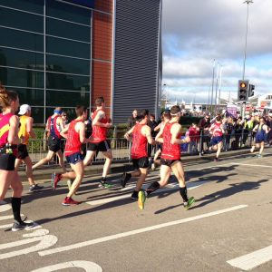
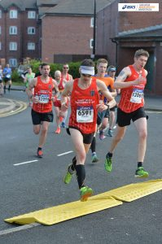
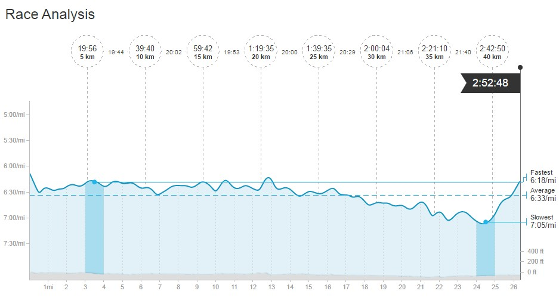
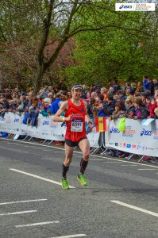
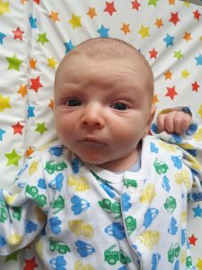

Which came first the baby or the marathon? As I write this several weeks after the fact then most, if not all will know the answer. Zachary Tomasz White was very good and arrived a whole 11 days late ensuring the weeks of training were not wasted.

## A Story of a Thousand Miles

Talking of training this wouldn't be a race report from me without a little training retrospective. I've had many conversations with Pete Dearing and we both subscribe to the training methodology of lots of volume with the majority easy combined with harder sessions. He would always try to do 1000 miles from the start of the year in the build up to London. I'd have three weeks less but had no problem trying to hit this type of target mileage in my build up. With the impending birth and a massive change on the horizon, I was even more determined to nail the training.

With that in mind, a typical week would be as follows

- Monday: PM - Easy 9
- Tuesday:
    - AM - Easy 6
    - PM: EHH Speed Work - 3 x 1200m, 1x 800m and 1 x 400m
- Wednesday:
    - Am - Easy 6
    - PM - 14 Midweek LSR
- Thursday: PM - Strength: 5 x 2 miles @ 6:20 per mile with 0.5 recovery plus 3 up and down
- Friday: AM - Recovery 5
- Saturday: AM - 7.5, Parkrun p(in 18:05 BTW) plus warm up and cool down.
- Sunday: AM - 21.2 - Fast long run including warm up

That was a 98-mile week, admittedly I didn't always hit those giddy heights however over the 17-week build up (from start of December) I think I averaged around 80 miles a week.

One thing I did learn is to keep some flexibility and don't have hard targets for each run. Rather I would have a range (e.g. 5-7 miles ..... ), therefore, allowing me to keep it shorter if I was struggling on a particular day. Also combining runs with commuting was a great way to increase the mileage without impacting on home life (something I'll be relying on in the future no doubt).

The key sessions each week were the "strength" reps. e.g. 5 x 2 miles @ 6:20 per mile with 0.5 recovery plus 3 up and down and the fast long runs. As the saying goes, train slow, run slow therrefore in my opinion, any experienced marathon looking to run fast has to do some long hard runs to get their body ready.

If you're interested I manage to get in 1030 miles from the 1st January to race day.

## Race Weekend

Originally we had planned to get the train but due to Katy now being 2 days overdue we reverted to plan B. I would drive down on my own late Saturday afternoon thus ensuring I could get back to Hull in the quickest possible time if needs be.

After a fitful nights sleep, race morning arrived. It would have been nice to have had a good nights sleep but after London, in 2015 I know that I can still perform and the night before isn't that important. Rather than hang around the hotel I got myself fed and showered and made the massive 6-minute tram journey to the start.

In hindsight, I was maybe a little too eager as this meant arriving before 7.30 am with over an hour and a half to kill. There was only one thing for it, find the Costa and get a good strong coffee. One benefit of arriving so early was I was able to soak up the atmosphere, relax and talk to some other runners before the start.

## Show Time

Before the start, I met up with Danny Wilson (DW) and Tom Dawson (TD). Having spoken to Tom via messenger the night before I knew we were both going to try and hit 6:30 per mile (or as I put it 8 x 5k's in 20 minutes plus a bit - I'd be tracking the marathon in kilometres and keeping an eye on the average pace hopefully staying under 4 minutes per kilometres), therefore, the plan would be to run together. Danny, on the other hand, said he was going to start with us for the first 5 to 6 miles and the settle into 6:45 pace (yeah right!).

Just before the start and Danny Jones (DJ) managed to find us. And before you know it we were off. The first mile is slightly downhill (having done the half marathon last October as a recce I was aware of part of the course) and is always quick.

We stayed together as a four and once it started to spread out after the first couple of miles we must have looked a fairly imposing site. There was plenty of shouts of "Go East Hull as we got into a rhythm with different people sharing the lead". I really enjoyed this part with the four of us as a group.

At the 3 mile mark, it was great to see Linda and Kadi Huart out in support. In fact, the support along this part, in particular, is great as the course goes back past the start ensuring big crowds lining the route. First 5k in 19:56, pretty much spot on.

I'm not sure when but somewhere around the 6-mile mark, 4 became 3. DJ after a 3-week hiatus in Iranian dropped off the pace. On his day with a sub 2hours 43 track marathon PB, he could have shown us all a clean pair of heels.

The next 5k/3-miles is one long road and the three of us stuck together picking up the pace slightly covering it in 19:44. A little fast but still feeling comfortable.

The course then twists and turn a little around Sale. It was at this point around 8/9-miles I started to gap the others slightly. I'm adamant that I didn't speed up and they slowed down slightly, although I'm sure DW and TD would say otherwise.

After Sale, the course follows a couple of long road towards Altrincham. This covers the next 10km with splits of 20:02 and 19:53 for each 5k segment. You never quite make it to Altrincham, as the course start to turn back and the long run for home (albeit via very scenic route).

I reached half way in around 85 minutes. It wasn't so long ago I would have been happy with that for a half marathon. Now I was trying to do 2 back to back.

By 14/15-miles the legs were starting to tire and the right hamstring was getting tight. This wasn't wholly unexpected as I use my right side more than the left, therefore, niggles do tend to appear in the right leg. One rest bite and distraction from the next two miles there is a steady stream of runners going in the other direction. I was able to occupy my mind with spotting red vest going in the opposite direction.

However, this didn't stop the inevitable decline happening as the effort really started to kick in. From around miles 15/16, it was going to be the usual war of attrition. The next 2 5ks passed in 20:00 and more tellingly 20:29 respectively.

The last 6 miles were a real slog, I was expecting DW and TD to come flying passed me at any point. I had no idea how near or far they were and looking back the gap was never more than 40 seconds. The inevitable happened around 20 miles with TD passing me and looking very strong. The gap started to grow and I thought that would be the last I saw of him. Also strangely my left calf started to spasm every so often. I just hoped it would hold out until the end. It's ironic that when you need the crowds the most, marathon courses end up in slightly more remote areas. And let us be honest, who wants to watch the miles just before the end of the marathon. By now I was being very negative in my head but obviously kept moving forward. However, my drop in pace shows with the next 5ks in 21:06 and 21:40. It was a good job there was only a couple of k's to go.

Then with a mile to go something miraculous started to happen, maybe it was the smell of the finishing crowd or the ever increasing crowd or the glimpse of DW just behind and TD just ahead but the legs started to pick up the pace again. I even managed to finish back on MP pace even if it was just the last half a mile.

## I Love It When A Plan Comes Together

From the outset I had said to anybody that asked I was training for a 2:50, realistically this may be closer to 2:55, therefore, to finish in 2 hours 52minutes and 45 seconds was truly magnificent. And to cap it off I was very happy to be the first Harrier home closely followed by DW and TD. As ever I have to thank Katy for the support and the countless meals I came home to throughout the training. I'd also like to thank my club mates for the training runs pushing me to achieve better times.

Also a big respect to the other EHH members out there. Lots of good times, impressive PB's and first times smashing it.

As for the future, I'll be retiring from Marathons (yes again) for the time being to focus on shorter distances which will be more compatable with family life. I have the small matter of trying to be the best father I can be to this little fella.
