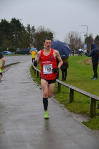

Just 6 days after the [EHH Boxing Day 10k](http://Boxing) , Katy and I were on our way at just gone 8 am on New Years Day to Cleethorpes. I'm sure most of you know I'm mad but this must be new levels of lunacy even for me.

However, the case for the defence is Katy (wife and also EHH member) is pregnant with our first child, hence I thought I'd take advantage of this fact. Unlike previous New Years Eve's Katy wouldn't be drinking, therefore, I stuck to a couple of glasses of wine allowing me to take on the New Years Day 10k at Cleethorpes.

Race day rolled around and the forecast had me questioning this decision. We arrived at The Beachcomber with plenty of time or so I thought. The car park was full but with plenty of side streets, parking wasn't an issue. It was obvious once we got inside most people must know how busy it is as with almost an hour and a half before the race there was plenty of runners already there.

After a good strong coffee, it was time to warm up. The start is a mile away, therefore, I left Katy to run to the start and get my 2 mile warm up in.

After de-layering, it was time to get near the start line which is down a nondescript residential side. Although the race is on New Years Day the race pays out some decent prize money up to and including tenth place ( If I only I could find a 2 minute 10k PB!) therefore I was expecting it to be busy at the front end.

After a short residential section, the race takes in a short two loop, section. It's worth noting that this can cause some confusion as the faster runners start lapping and finish loop two they go right. Make sure you go left if you've only done 1 loop.

On each loop, once we got back to the sea front I lost time going into the wind. Thankfully this section finished just before 3 miles (5k in 19:07) therefore I was hopeful I could claw some time back in the second half.

3 long roads make up the majority of the second half, not the most scenic but very flat. My only complaint would be a marshal standing next to a path pointing left and then shouting at us for cutting the course short meaning I had to detour back to the road. I know it's sometimes a thankless task, therefore, I wouldn't normally complain but all they had to do was stand away from the racing line and at the T junction 2 metres further along.

Anyway working hard to try and keep sub 6:10 pace before the final three-quarters of a mile back into the biting headwind. I managed to raise the pace for this final section, however, the second 5k was slower covered in 19:27 for a 38:34 fishing time.

Overall considering the unfavourable conditions happy to once again finish in the 38s and only 3 seconds difference between this race and the [EHH Boxing Day 10k](http://dlw.me.uk/2017/01/15/ehh-boxing-day-10k/) showing excellent consistency (if a little slower than I'd like!).

Next up Great Winter Run 5k in Edinburgh.
