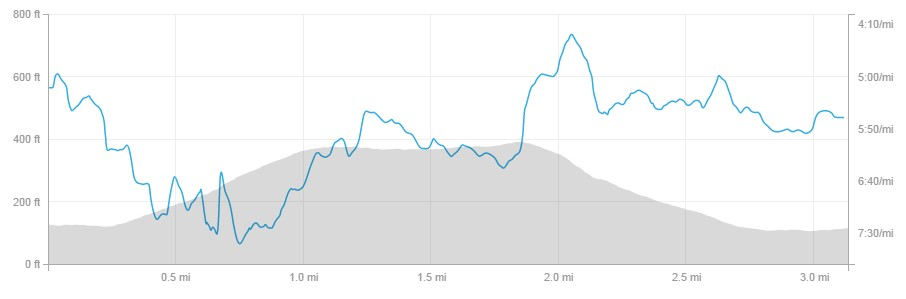

Another 6 days later and another road trip, this time to Edinburgh for the Great Winter Run 5k. For those that don't know this is one of the now many Great Run events (the clues in the title). This one is the mass event on the roads around Holyrood Park in Edinburgh before the elites take on the XC live on the good old BBC. You may have heard of a certain Sir Mo Farah was taking part. Personally, I was looking forward to seeing Callum Hawkins and Laura Muir in action.

Sensibly I had recce'd the course the day before, however not so sensible was not checking which direction the loop of Holyrood Park the course went, therefore, I had ended up doing two laps the wrong way round!

\[caption id="attachment\_239" align="alignright" width="225"\] Flying the red flag in my new vest at the Great Winter Run 5k, Edinburgh\[/caption\]

Unseasonably mild conditions for race day making vest and shorts the order of the day. Runners started in waves and being one of the "Faster Paced Club Runners" ensured I started at 10.

The first quarter of a mile is flat before the race goes uphill to over 300ft by the end of the first, therefore, it's critical to get a fast start. I made sure I did my best greyhound impression shooting out the blocks.

I don't view myself as a very good uphill runner as anybody who has raced with me will verify. However, something strange happened. As the race went uphill I kept passing other runners. I had expected the exact opposite but apparently, I had entered a parallel universe. First mile in a not too shabby 6:37.

The course flattens out after a mile and I already knew from the day before that once you're at the top you get a spectacular view of Edinburgh and the river. However, even during the race, it was still equally as impressive as the day before.

Approaching 2k (the course is marked in kilometres) I could hear the distinct sound of bagpipes. A nice touch by the organisers is that at the 2, 3 and 4k marks the air was punctuated by bagpipers in the full regalia giving you a little boost as you knew another k was approaching.

Taking advantage of the flatter section the second mile passed in 5:57 - it's always good to be back in sub 6 territory. Something which I need to do in all races and especially those of a longer distance.

\[caption id="attachment\_240" align="alignnone" width="906"\] Excellent screenshot showing the Great Winter Run 5k Course Profile\[/caption\]

"What goes up, must come down" is a well-worn saying in running circles but it's so often apt. Today was no different and in a reversal of the uphill section it was me that was being passed by a few other runners. My short stride just couldn't up the cadence to take as much of an advantage as the other runners.

However, the combination of downhill, chasing other runners and the crowds along the finishing straight meant the last mile was covered in 5:23. Job done in a fairly respectable 18:43, as ever I'd like a little more.

To finish off, I'd recommend a trip up north as it's a well-organised race, with great crowds and a brilliant setting of Holyrood park plus the benefit of watching the elites in the afternoon. And not forgetting all the tourist things to do in Edinburgh.
