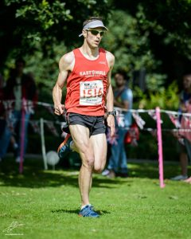

Not many people will realise that although I was born in Nottingham I actually for my sins grew up just south of the river in Grimsby and Cleethorpes. Therefore when Tape2Tape announced a 10k in my previous hometown, it was one I wasn't going to miss.

Over 1200 runners lined up for the inaugural 10k with plenty from EHH and the other local clubs. In addition the merry band of supporters had made the trip to support the runners along the route.

The race starts at the town hall in the town centre before quickly turning left to sweep past the council depot and right at a a mini roundabout to offer us our first glimpse of People's Park (where we would be finishing). It was around this point I had settled into a group including Danny Wilson and Keri Pearson (CoH). Danny started to gap us, so should I stick or twist. As I was still feeling pretty good I decided to twist and follow Danny hoping he wasn't going out to fast (I wasn't sure what pace we was doing as I wouldn't look at my watch until 5k).

This race was always going to be a trip down memory lane and first stop was a left turn onto the first major road taking us past the Wheatsheaf, this is the pub I drank in as a student at Grimsby College. Talking of which, the route then goes past the aforementioned college, the second stop on memory lane before a left turn onto Scartho Road (drop the h unless your posh).

Myself and Danny were keeping a decent pace past the now closed Swimming Pool and the Nunsthorpe Estate (the main estate I live in, in Grimsby). At some point along here we past Eddie Rec who had gone off like a rocket. Also in the distance was my namesake Darren Edge (BEV), in the back on my mind I thought I'd try and close the gap. Knowing that Darren usually "edges" me in races and if I can get close to him I'm having a good day.

Next stop on the whistle stop tour is the entrance to the hospital. I spent many a mis-spent youth jumping on the back of the food/laundry carts (we use to call them yellow coaches) to get a lift before the route then passed the big houses which were good for a apple foraging. Up next is a left turn at Scartho past one of the many places my parents used to show rabbits (yes, rabbits!).

At the 4km mark up the only real incline Danny started to gap me. Unable to bridge the bridge the distance on the descent the route goes left onto the new road (admittedly built when I still lived in Grimsby so hardly new anymore!). Just before this I passed through 5km in around 18:50 - a little off what I'd have liked but still on target for a low 38.

After a short section the route then goes left onto the very straight Peaks Parkway. Thankfully I had been joined by a Sheffield Strider runner and could still see Danny in a group of 5 ahead. I tried to bridge the gap but I thin it was much bigger than it looked. By this point it really was hurting and as we passed through the "mad" mile it was a case of digging in and trying to maintain pace to hopefully finish in the low 38s or sub 38.

\[caption id="attachment\_233" align="alignright" width="240"\] Strong finish at the Grimsby 10k 2016\[/caption\]

A left turn onto Weelsby Road and a relatively short section before entering the park for the final stop (and finish) down memory lane. People's' Park has happy memories for me having spent many a happy hour playing hide and seek and feeding the ducks there. Thankfully the happy memories will continue as after a sprint for the line I finished in 37:58 getting under the elusive 38 barrier again. It's only taken over a year since Leven 10k 2015.

I wasn't the only one to have a good day. Roared on by the great support Danny Wilson finished 1st harrier in 37:31 for 34th place. Not to be outdone there was pb's for Kirsty Wilson - 43:32 (on the back of a 19 mile long run the day before!), Keith Conkerton - 44:25 and Mandy Davison - 52:34. I'm sure there were other therefore sorry if I've missed them.

Impeccable organisation, great support and atmosphere particularly at the start and finish, a decent good bag if that's your kind of thing plus a fast and flat course, what's not to like? It can only bolster Tape2Tape's reputation as a top quality events organiser. I for one will be back as I'm sure will be many others.

## Results

Position

Name

Mad Mile

Chip Time

Gun Time

34

Danny WILSON

00:06:02

00:37:31

00:37:35

40

Darren WHITE

00:06:04

00:37:58

00:38:04

75

Eddie REX

00:06:45

00:39:38

00:39:40

79

Sara Rookyard

00:06:33

00:39:48

00:39:55

84

Tony CROSS

00:06:30

00:39:58

00:40:03

169

Ellie MANN

00:06:56

00:43:23

00:43:34

170

Chris SUMPTON

00:06:56

00:43:23

00:43:34

178

Kirsty WILSON

00:06:54

00:43:32

00:43:42

191

Stephen TICHOPAD

00:07:06

00:44:01

00:44:09

201

Dave PLAYFORTH

00:07:14

00:44:17

00:44:27

225

Keith CONKERTON

00:06:58

00:44:25

00:45:20

215

Tony Goulding

00:07:02

00:44:38

00:45:02

255

Wayne MARTINDALE

00:07:31

00:45:53

00:46:12

260

Paul REED

00:07:32

00:45:58

00:46:18

299

Katie SEDDON

00:07:35

00:46:21

00:47:05

293

Richard ALSOP

00:07:32

00:46:44

00:46:58

307

Karl ROLSTONE

00:07:42

00:47:01

00:47:16

326

David MASKELL

00:07:30

00:47:02

00:47:58

345

Linda HUART

00:07:45

00:47:54

00:48:15

346

Kelvin WESTERMAN

00:07:54

00:48:03

00:48:16

365

Lee CAMPBELL

00:08:08

00:48:06

00:48:44

367

Magdalena ZAREMBA

00:08:02

00:48:32

00:48:45

487

Martin HOWMAN

00:08:19

00:50:12

00:51:11

520

Andrew FEWSTER

00:08:50

00:51:58

00:52:10

570

Mandy DAVISON

00:08:36

00:52:34

00:53:31

588

JOHN CROSBY

00:08:35

00:52:57

00:53:53

600

Katy WHITE

00:08:51

00:53:14

00:54:13

599

Paul WRIGHT

00:08:34

00:53:36

00:54:11

685

Gary ROBINSON

00:09:32

00:55:08

00:56:07

651

Tracey ASHTON

00:09:08

00:55:13

00:55:34

698

Paul BACKEN

00:09:32

00:56:22

00:56:22

749

Graham ROGERSON

00:08:54

00:56:47

00:57:38

810

Neil MICKLEBURGH

00:09:09

00:58:43

00:59:02

878

Graham HALL

00:10:04

01:00:13

01:00:59

917

Sheila MADDISON

00:10:03

01:00:58

01:02:05
