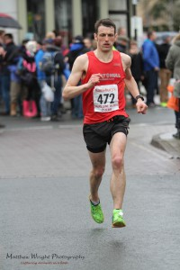

Why is it called Snake Lane it not something that passes the lips of a finisher of this race. It sneaks and "snakes" it way out into the countryside past fields and small villages. At several points you can look up to see lines of runners circumnavigating the country lanes.

Unless you're the winner of course, that accolade went to the rather appropriately named Russ Best completing in a quite unfamoulable (at least for me) time of 00:52:40. The view would not have been too dissimilar for our very own Mike Hargreaves, finishing in an impressive 00:54:33 for third place. Sticking with third well done to the aforementioned Mike Hargreaves plus Chris Adams (00:59:03) in 17th and Gareth Young (00:59:39) in 21st taking the third men's team prize.

Before I bore you with the details of my race it was great to see the race supported as well as ever, with 35 members competing. On top of that I saw plenty of members, their friend and families out supporting, without which the race would not be what it is.

Back to the runners, there was some great performances. Michael Petersen proving that he does race longer than 10k and getting a PB of 01:07:05 (118th) for his efforts. The ever improving Danny Wilson bagged another PB, finishing in 01:06:23 (108th). Not quite a member but should be soon Andrew Deyes showing his ability already with a PB of 01:04:09 (56th), beating his time from 4 weeks previous at Ferriby 10 (01:04:34).

As for my race the intention was to average 6.30 and finally go sub 65 for 10 miles. At the start I was a little penned in, apparently being in front of the sub 70 minute sign doesn't actually equate to those around you doing 7 minute miling. However rant over, it forced me to start steadier which I don't always do.

Somewhere between 1 and 2 miles I caught Sara Rookyard. Knowing she is the pacing queen I would have stayed put however we was being gapped by a small group in front and the pace wasn't quite fast enough. I decided to push on and make the chase.

Once caught I could see Danny Wilson and Steve Taylor not too far off. It won't come as any surprise to many that they instantly became my next target. I think I finally caught them around the 4 mile mark just before the race course turns left and drop downs briefly along a track.

At this point Mike Petersen and Eddie Rex was also just ahead, all of us merging as one pack with a couple of other runners around 5 miles, which we went through in 32:53. I was hopeful of pulling back the half a minute in the second half but very aware that we had already had the best of the wind and would most likely be running into a head wind in the second half. This race unlike The Ferriby 10 in my opinion as an easier first half than second but it does have a fast finish. Could I make the time up?

And as promised the wind really hit us around 7 miles, resulting in a too slow 6:51 mile. I kept surging but no matter how hard I tried I couldn't reduce the pace per mile low enough, the next two miles in 6.48 and 6.42. I did manage to drop the others  except Graham Jones of Valley Striders. The plan now was just to try and  hang on to him and finish with quick last mile.

However although I did pick up the pace a little with a 6.35 I finished in 01.06.07 and over a minute outside my goal. Obviously that is a negative and I hoped to be well under 65 by this time of the year. However the positives from the race outweigh the negatives. Has already mentioned the great turnout from Harriers and battling with teammates. I felt stronger than I have for a while. It's my seconds fastest 10 miler ever. And my second 5 miles was only 14 seconds slower than the first half meaning I didn't fade as much as I thought.

The plan now is to keep the training hard and do it all again on April 17th at the Vale of York 10.
