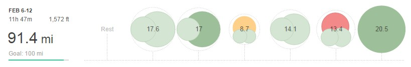

Another solid week of training and racing. Again it's not 100 miles but still just over 90.

## Week 6 – 91.2MI (11H 47M)

Monday Rest Day!

Tuesday AM: 6mi - Base Mileage PM: 11.6mi - Tempo ten with club plus short warm-up and cool down

Wednesday AM: 5mi - Base Mileage PM: 12mi - Base Mileage

Thursday PM: 8.7mi - 6 x 1k plus warm-up and cool down

Friday AM: 5.1mi - Base Mileage PM: 9mi - Base Mileage

Saturday AM: 13mi - 7mi Winter League race plus warm-up

Sunday AM: 20.5mi LSR

In the end, Monday became an unplanned rest day. Seeing as I hadn't had one since Christmas Day, I'll let myself off.

That meant going into Tuesday's tempo I was much fresher than normal (particularly after an easy Sunday the previous week). I ran with the club and in all fairness was a little slower than I would have liked, ideally closer to 6:30 average. However, it was good to feel so comfortable running a 6:44 average for 10 miles.

Due to family commitments Thursday I drove to work and then stopped by the track on the way home for a quick session as I had to be back at 7 pm. After a decent warm-up, it was 6 x 1k reps targeting 3:30 per km, splits of 3:31, 3:31, 3:32. 3:32, 3:29 and 3:29 off a 400m recovery. Pretty pleased with those splits and considering I was being snowed on at one point.

Another reason for keeping Thursday's session short was my club's Winter League on the Saturday. I'll have a full report shortly but another strong winter league showing placing 2nd on actual time. Admittedly it wasn't a stacked field with only 52 runners but hey you can only race who is there.

Sunday's long run was a real tester, not only was it a proper LSR aiming to run around 8-minute mile pace (sometimes I find longer runs challenging mentally just because I'm out there for a long time), the weather was the worse it's been for a long time. However, it could be like that race day and I got through it. The best thing was how comfortable the pace felt and if need be I could have run further (although my hands may have a different opinion).
