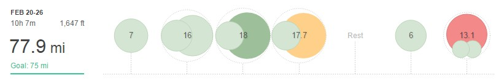

Another race week, therefore, the target was 75 to 80 miles as follows:

## Week 8 – 77.9MI (10H 7M)

**Monday** AM: 7mi easy

**Tuesday** AM: 6mi easy PM: 10mi easy

**Wednesday** AM: 5 mi easy PM: 13mi LSR

**Thursday** AM: 5.2mi easy PM: 12.5mi strength workout, 4 x 1.5 mi with 0.5 mi recovery (plus 3 warm-up and 2'ish cool down)

**Friday** Rest Day

**Saturday** AM: 6 mi easy

**Sunday** AM: 13.1 mi (1. 5mi warm-up + 10 mi race + 1.6 mi cool down)

After last weeks hard week, I decided to keep it easy Monday and Tuesday as the legs were feeling particularly heavy and fatigued.

Therefore it was Thursday before I did a hard session (even Wednesday long run was on the shorter side). With one eye on Snake Lane at the weekend, Thursday's strength session was on the shorter side. All reps were spot on and were, in fact, a little under the 6:20 per mile pace.

I'll do a full report for Sunday but in summary, a bit disappointed not to go under 61 or at the very least under 61:30. However, a PB is a PB even if it's only 2 seconds!

Next 2/3 weeks are the final big weeks before tapering. Although I do have a 15 miler off road and a 5k planned.
