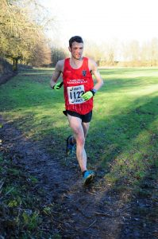
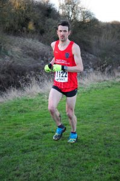

Who doesn't enjoy 8 miles off road through muddy fields, across ditches and navigating around fences?

At 2 pm on Saturday 14th, you'd find me just about to start the third race in my running Clubs Winter League Race Series. This race for the men is the longest (but not the hardest) and as the added kudos of being our cross country championship race. A trophy is up for grabs for the winner as well as the first new member to finish. I'm unlikely to ever win the race outright but I can at least console myself with the fact I did win the latter trophy when finishing 5th in 2015.

Anyway rather than reminiscing, onto the race. As ever I had a cheeky look to see who was there. Likely candidates would be Danny Jones and Jeff McQueen. However, both are generally quicker and DJ has been running very strong lately.

The first section runs alongside the drain and leads to a fast start. I had the added motivation of wanting to get some space between me and the mass of runners behind as there is a gate to negotiate. A fast group broke away with me in the second group with the aforementioned Jeff and Addie.

\[caption id="attachment\_271" align="alignright" width="199"\] 3 miles down, 5 to go!\[/caption\]

After about half a mile the course takes a right turn skirting a football field and the outer perimeter of Loglands. This is the most runnable section which is probably why it felt good at this point (and we were still in the first mile). A short sharp climb before a nice descent to finish off the first mile, passed in decent 6:23.

After the first mile, the course takes in 2 fields, the first of which as a decent grass edge and isn't too muddy except for the first right-hand corner making the going reasonably ok. However, the majority of the second mile takes in another field with very soft mud that no matter what footwear I use my trainer grow to twice their size. At this point, I started to loose contact with Jeff who is a demon at traversing the mud. However the second mile was still completed in 6:36 and third in 6:46, for me that's pretty good. Hopefully, I could keep that up or at the very least stick to under 7 minutes per mile.

The third mile brings you back around Loglands before run back along the drain, a short section to cross a road and back along the other side of the drain before joining the Hornsea Trail (and a section of tarmac) just before the 4-mile mark. 4th mile in 7 minutes which wasn't a good sign, the gap to those in front increasing all the time.

The relief of the trail and tarmac is short lived as another field beckons with a left turn. It's normally one of the bad ones but this year although it was still very sticky in places, thankfully there was an edge of grass in places which you could run on. By the end of the 5th mile, completed in 7:08, Jeff had a commanding lead which I was unlikely to bring back. The only consolation I couldn't see anybody in the field behind me.

\[caption id="attachment\_272" align="alignleft" width="199"\] I think the face says it all, about 7 miles in\[/caption\]

A little jump over a drain, around another field before the more runnable section as the course takes in a farmers track. Another drain to negotiate, this time while holding onto a fence. I would have expected to make up some time but in fact, it was the slowest mile completed in 7:13.

Finally the long drag to the finish following the drain, back over the trail and road. The 7th mile in 6:49, and final 0.8 in 5:22 to finish 6th in 53:18, a full 50 seconds behind Jeff. However, I was 3:42 in front of 7th. It was tough although some of the miles were over 7 minutes, my average pace of 6:50 per mile is pretty good for me when it comes to cross country.
