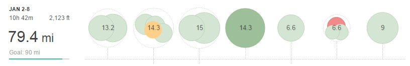

Before I get into the training lets back up slightly. 2017 will be a year of transition for me with my partner expecting our first child.

Talking of which the due date is the end of March and the target is Manchester Marathon, which for those that don't know is on the 2nd April, eeeek.

There is a plan B as I'm also in London, I'm still hopeful that I can do Manchester as I believe it's a faster course. Many of my club mates have done it and got some good times (inc. when it was the right length!).

Whatever happens, I'll be getting the miles in and will do a very short sharp taper, allowing me to increase the mileage if baby arrives beginning of April and I do end up missing Manchester.

From the start of January, I plan to do 1000 miles (or more) in the lead up to the marathon. One of club stalwarts said he always did that in the lead up to London and with a marathon time of around 2hour 45, who am I to argue. Each week would consist of:

- two long runs - one at the weekend and one midweek with the weekend one being longer. Also, I'd look to do a long fast run at marathon pace every 2 to 2 weeks
- strength workout, for example of repetitions 3 x 2 miles, 2 x 4 miles
- tempo/threshold run of anything from 6 to 10 miles or maybe more (see long runs above)
- And then lots of easy runs on the road and cross country

Of course, that isn't set in stone and I will do shorter speed work, hills and the occasional Parkrun and race. Anyway without further ado onto the training:

## Week 1 – 79.4 MI (10H 42M)

**Monday** AM: Easy 7 mi PM: Easy 6 mi

**Tuesday** AM: Recovery 3.7 mi PM: 10.5 mi inc. 4.1 mi warm up + 5 x 800m, 2 x 400m + 3.4 mi cool down

**Wednesday** AM: Easy 9 mi (commute) PM: Easy 6 mi

**Thursday** PM: 14.3 mi midweek LSR

**Friday** AM: Easy 6.6 mi - Holyrood Park Recce as racing the 5k the next day

**Saturday** AM: Raceday - 2.5 mi warm up + 3.1 mi race + 1 mi cool down

**Sunday** PM: Easy/Recovery 9 mi

The target for the week was 90+ miles, however, with a [Cleethorpes New Years Day 10k](http://dlw.me.uk/2017/01/19/cleethorpes-new-years-day-10k/) race on Sunday 1st plus the [Great Winter Run 5k](http://dlw.me.uk/2017/01/20/great-winter-run-5k/) (while on vacation), it was always going to be hard to get the miles therefore 2 good races in 7 days, speed work and a midweek long run I have got to be happy. One final thing I should add is that after a couple of weeks off at the start of November I was averaging 70+ miles coming into the start of the year. And covered over 2500 coming into 2017, therefore, I had a strong base before trying to do even greater mileage for this block of marathon training.
