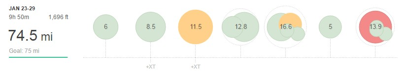

A reduced mileage week with my eye on the weekend's 10-mile road race. The aim would be to do approx. 75 miles and I only came up half a mile short so I can live with that:

**Monday** AM: 6mi recovery

**Tuesday** PM: 8.5mi easy

**Wednesday** PM: 11.5mi - Strength: 4 x 1mile with 0.25 recovery + 3 warm-up + 2.5 cool down

**Thursday** AM: 4.4mi Recovery XC PM: 8.3mi – Base mileage

**Friday** AM: 7.5mi - Base mileage XC PM: 9.1mi - Speed: 4 x 1k, 5 x 200m off 400m recovery plus warm up and cool down

**Saturday** PM: 5mi – very easy pre-race day

**Sunday** AM: 13.9mi - 10mi race plus warm up and cool down

The first key session after I had recovered from previous weeks fast long run was on Wednesday. A shorter strength session easily managing well under 6:20 per mile. All the miles are starting to pay off.

By Friday I was a little short of miles, ideally, I would have done a lower overall total but I did keep the reps fairly short and only 3 miles for the hard part. The target time of 3:30 per kilometre and 35 seconds per 200m rep. I was a little slow but not by much so I'll take that. Plus with only two days to race day, I didn't want to overdo it.

Come race day and I felt pretty sluggish. I won't go into too much detail as I'll have a full report but to summarise, a 10 mile PB by almost 3 minutes says it all.

Next week back to the 100-mile week, oh joy
